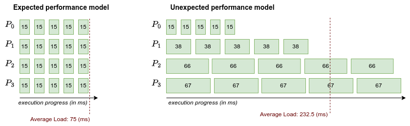
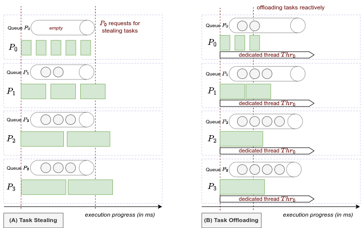
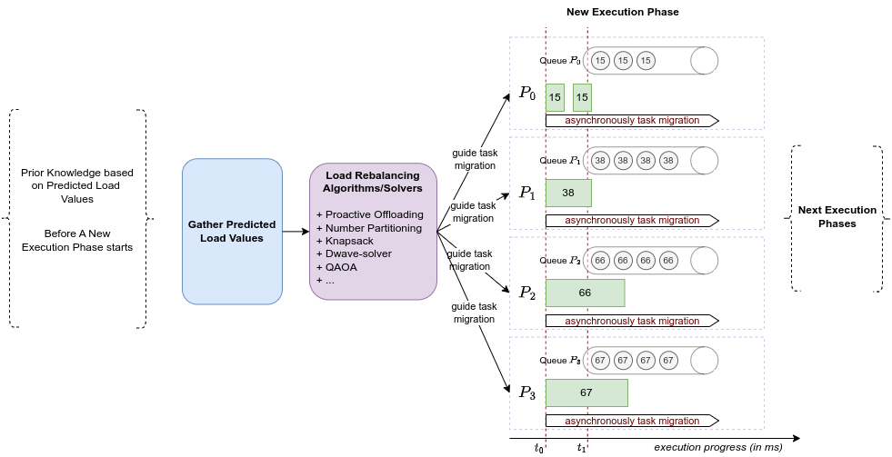
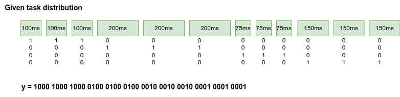

# qulrb

Load rebalancing problem and quantum approximate optimization approach

### Load Rebalancing Problem

* Formulation by Aggarwal et al. [SPAA-03]
    + Given $n$ jobs with the following sizes $\{s_{1}, s_{2}, ..., s_{n}\}$
    + Assigned on $m$ processors $\{P_{1}, P_{2}, ..., P_{m}\}$
    + Problem: relocating jobs among the processors to minimize the makespan, where
        - $makespan$: the completion time
        - relocating cost: $c_{ij}$ when moving a job from processor $i$ to processor $j$

    [SPAA-03] Gagan Aggarwal, Rajeev Motwani, and An Zhu. 2003. The load rebalancing problem. In Proceedings of the fifteenth annual ACM symposium on Parallel algorithms and architectures (SPAA '03). Association for Computing Machinery, New York, NY, USA, 258–265, https://doi.org/10.1145/777412.777460.

*Figure 1. Problem formulation.*

* Re-formulating and mapping the load rebalancing problem in a context of task-based parallel applications in HPC
    + A given distribution of $n$ tasks on $m$ processes, where each process might be pinned to a CPU/processor.
    + If the execution happens expectedly, load per task is the same, and the total load among processes is balanced like the left figure shows.
    + If the execution happens unexpectedly (e.g., wrong performance model for task distribution before the execution), load per tasks per process might be different. The total load among processes is unbalanced like the right figure shows.

### Objective

* Migrate tasks to balance the load
* How many tasks should be migrated? From which process to which process?

### Approaches

*Figure 2. Task stealing and task offloading approach.*

* Dynamic:
    + Task stealing (work stealing) without prior knowledge about load values/the length of tasks. During execution, when the queue of a process is empty, it starts asking to steal the tasks from the other processes, as shown in Figure 2 (A).
    + Reactive task offloading without prior knowledge about load values/the length of tasks. During execution, each process dedicates a thread for checking queue status continuously and offloading tasks reactively if it detects load imbalance based on the queue status at a time, as shown in Figure 2 (B).

*Figure 3. A hybrid approach with prior knowledge based on load predicted values at runtime.*

* Hybrid: works in the case, the load imbalance or the performance model of tasks can be predicted before a new execution phase starts.
    + First, assume we have predicted load values before a new execution starts. For example, as Figure 3 shows, $P_{0}$ has 5 tasks, each takes $15ms$; $P_{1}$ has 5 tasks, each takes $38ms$ and so on.
    + Second, apply a solver/algorithm to find the solution: how many tasks should be migrated? from which process to which process?
    + Third, the delay of task migration might be taken into account, even task migration can start early.

### Motivation

* From the view of optimization, load rebalancing problem can be considered as an optimization problem [SPAA-03].

* Compared to the classical algorithms, how this problem can be formulated and solved in quantum computing?

<!--     
    + Assigned on $m$ processes (processors) $\{P_{0}, P_{1}, ..., P_{m-1}\}$

    + Problem: load imbalance among processes due to performance slowdown, need to relocate tasks or migrate tasks, where we also aim to minimize makespan,
        - $makespan$: the completion time of all processes
        - migration cost: $c_{ij}$ when moving a task from process $i$ to process $j$

* Example: $20$ tasks in total, assigned to $4$ processes, the load values are illustrated as follows.

### A try for QUBO formulation

* Given $n$ tasks with execution time/load: $\{t_{0}, t_{1}, ..., t_{n-1}\}$
* Given a distribution on $m$ processes: $\{P_{0}, P_{1}, ..., P_{m-1}\}$.
* Binary variables following the given tasks: $\{x_{0}, x_{1}, ..., x_{n-1}\}$
* According the given information we know the load imbalance, e.g.,
    + In the above example, $n = 20$ tasks, $m = 4$ processes, tasks are binarized $\{x_{0}, x_{1}, ..., x_{19}\}$.
    + We know that: $P_{0}, P_{2}$ are underloaded processes, $P_{1}, P_{3}$ are overloaded.
    + Assume task migration happens, we have the objective function:

        `minimize` $y = \sum_{i \in n_{0}} t_{i} x_{i} + \sum_{i \in n_{2}} t_{i} x_{i} - (\sum_{i \in n_{1}} t_{i} x_{i} + \sum_{i \in n_{3}} t_{i} x_{i})$

        where, $\{n_{0}, n_{1}, ..., n_{m-1}\}$ is a new subset of tasks on each process.
    
    + The constraints include:

        $n_{0} + n_{1} + n_{2} + n_{3} = n$

        $n_{0} \leq k_{0}$, $n_{1} \leq k_{1}$, $n_{2} \leq k_{2}$, $n_{3} \leq k_{3}$, with $k_{i}$ is the maximun number of tasks that a process $i$ can hold.

### Another way to formulate the problem

* Using one-hot encoding (idea from Justyna):
    + For example, with a given task distribution and load values, we assume, $n=12$ tasks, $\{100, 100, 100, 200, 200, 200, 75, 75, 75, 150, 150, 150\}$.
    + The number of processes is $m=4$, each has $3$ tasks.
    + Using one-hot encoding to represent the tasks assigned in a process

    

* Migrating or no migrating tasks
     -->

